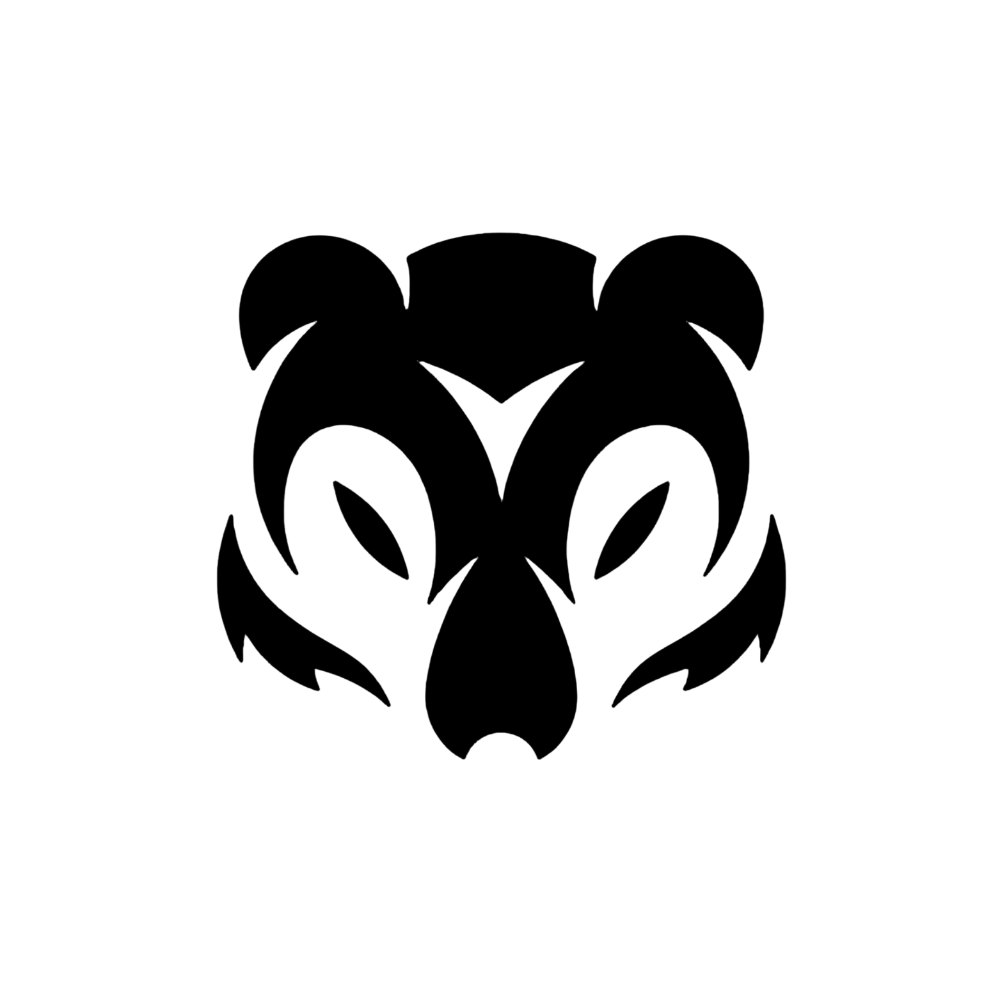
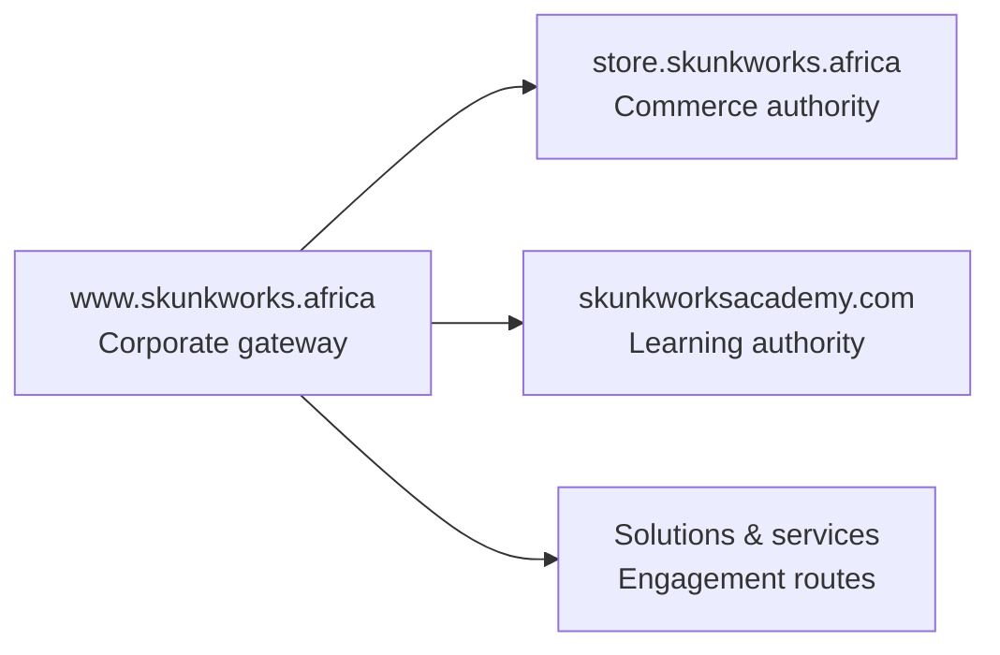
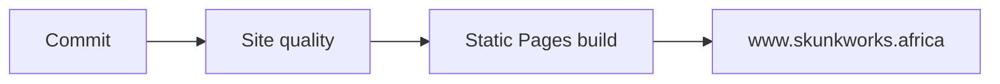

<div align="center">

<a href="https://www.skunkworks.africa/" aria-label="Open Skunkworks Africa">
  <picture>
    <source media="(prefers-color-scheme: dark)" srcset="./assets/logo-white.png">
    <source media="(prefers-color-scheme: light)" srcset="./assets/logo-black.png">
    
  </picture>
</a>

# Skunkworks Africa

### Canonical Web Gateway

<p>
  <picture>
    <source media="(prefers-color-scheme: dark)" srcset="https://readme-typing-svg.demolab.com?font=Inter&weight=700&size=24&pause=900&color=FFFFFF&center=true&vCenter=true&width=760&lines=Technology+capability.;Commerce+and+learning.;One+connected+African+ecosystem.">
    <source media="(prefers-color-scheme: light)" srcset="https://readme-typing-svg.demolab.com?font=Inter&weight=700&size=24&pause=900&color=000000&center=true&vCenter=true&width=760&lines=Technology+capability.;Commerce+and+learning.;One+connected+African+ecosystem.">
    
  </picture>
</p>

[](https://www.skunkworks.africa/)
[](https://github.com/skunkworks-africa/www/actions/workflows/site-quality.yml)
[](https://github.com/skunkworks-africa/www/actions/workflows/static.yml)

[](./LICENSE)
[](https://github.com/skunkworks-africa/www/commits/main)
[](https://github.com/skunkworks-africa/www)
[](https://github.com/skunkworks-africa/www/issues)
[](https://github.com/skunkworks-africa/www/stargazers)
[](https://github.com/skunkworks-africa/www/tree/main)

**The public corporate entry point for Skunkworks Africa—routing organisations to technology solutions, commerce, services and learning.**

[Explore the website](https://www.skunkworks.africa/) · [Browse the store](https://store.skunkworks.africa/) · [Open the Academy](https://www.skunkworksacademy.com/) · [Report an issue](https://github.com/skunkworks-africa/www/issues/new)

</div>

---

## The connected ecosystem



| Surface | Authority | Primary responsibility |
|---|---|---|
| 🌍 [**Corporate gateway**](https://www.skunkworks.africa/) | `www.skunkworks.africa` | Company, solutions, services, contact and ecosystem routing |
| 🛒 [**Commerce**](https://store.skunkworks.africa/) | `store.skunkworks.africa` | Products, collections, search, cart, customer accounts and checkout |
| 🎓 [**Learning**](https://www.skunkworksacademy.com/) | `www.skunkworksacademy.com` | Courses, labs, credentials and learner pathways |

> [!IMPORTANT]
> This repository owns the corporate gateway. Product and collection content remains on Shopify; course and learner content remains in the Academy ecosystem.

The detailed routing policy lives in [`docs/CANONICAL-NAVIGATION.md`](./docs/CANONICAL-NAVIGATION.md). The machine-readable route contract is [`site-map.json`](./site-map.json).

## Design language

<div align="center">

| ◐ Adaptive | ◻ Monochrome | ↔ Responsive | ◎ Accessible |
|:---:|:---:|:---:|:---:|
| Follows the visitor’s light or dark preference | Black, white and opacity-derived neutrals | Fluid cards, navigation and content hierarchy | Keyboard focus, reduced motion and semantic structure |

</div>

The corporate site and Shopify Horizon storefront share one visual contract:

- **Light mode:** white canvas with black foreground.
- **Dark mode:** black canvas with white foreground.
- **Colour discipline:** no independent accent palette; muted text, borders and surfaces derive from the active foreground.
- **Navigation:** one global primary navigation with a burger-controlled mobile menu.
- **Structure:** constrained content width, clear route hierarchy, responsive cards and a full ecosystem footer.
- **Motion:** subtle interaction feedback with `prefers-reduced-motion` respected.

## Repository map

```text
.
├── index.html              # Corporate landing page
├── styles.css              # Core adaptive visual system
├── adaptive-shell.css      # Shared header and footer shell
├── site.js                 # Navigation and progressive enhancement
├── site-map.json           # Machine-readable route contract
├── assets/                 # Adaptive logos and brand media
├── docs/                   # Canonical navigation and QA guidance
├── scripts/                # Dependency-free validation
└── .github/workflows/      # Quality gates and Pages deployment
```

## Run locally

No dependency installation or build step is required.

```bash
git clone https://github.com/skunkworks-africa/www.git
cd www

# Serve the repository root with any static web server:
python -m http.server 8080
```

Open [`http://localhost:8080`](http://localhost:8080).

### Validate before committing

```bash
node --check site.js
node scripts/validate-site.mjs
```

GitHub Actions runs the same quality checks on pull requests and pushes to `main`.

## Delivery pipeline



| Gate | Purpose | Status |
|---|---|---|
| [Site quality](https://github.com/skunkworks-africa/www/actions/workflows/site-quality.yml) | Validates JavaScript and the site contract | [View runs](https://github.com/skunkworks-africa/www/actions/workflows/site-quality.yml) |
| [GitHub Pages](https://github.com/skunkworks-africa/www/actions/workflows/static.yml) | Packages and deploys the static repository root | [View deployments](https://github.com/skunkworks-africa/www/deployments) |
| [Production QA](./docs/QA.md) | Verifies DNS, TLS, routes, responsive behaviour and accessibility | [Open matrix](./docs/QA.md) |

The repository includes [`CNAME`](./CNAME) for `www.skunkworks.africa`. Before a production cutover, verify DNS and TLS, then complete the [QA matrix](./docs/QA.md).

## Shopify alignment

The public commerce authority is **[store.skunkworks.africa](https://store.skunkworks.africa/)**. Public links must never prefer connected `*.myshopify.com` aliases.

Shopify Horizon changes are staged on an **unpublished theme** before any live publish. Corporate routes must not be implemented by duplicating Shopify product or collection pages in this repository.

## Contributing

1. Create a focused branch from `main`.
2. Keep navigation consistent with the canonical route contract.
3. Preserve adaptive light/dark behaviour and keyboard accessibility.
4. Run both local validation commands.
5. Open a pull request and confirm both workflows pass.

<details>
<summary><strong>Production readiness checklist</strong></summary>

- [ ] Canonical URLs point to the correct ecosystem authority.
- [ ] Navigation works with keyboard, pointer and touch input.
- [ ] Light and dark colour preferences remain readable.
- [ ] Mobile layouts work from 320 px upward.
- [ ] JavaScript passes syntax validation.
- [ ] `scripts/validate-site.mjs` passes.
- [ ] DNS, TLS and GitHub Pages deployment are healthy.
- [ ] The QA matrix is complete.

</details>

---

<div align="center">

### Build capability. Route clearly. Scale responsibly.

[Website](https://www.skunkworks.africa/) · [Store](https://store.skunkworks.africa/) · [Academy](https://www.skunkworksacademy.com/) · [GitHub organisation](https://github.com/skunkworks-africa)

<sub>© Skunkworks Africa · Adaptive by design · Built for the African technology ecosystem</sub>

</div>
