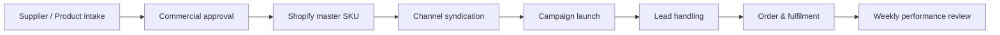
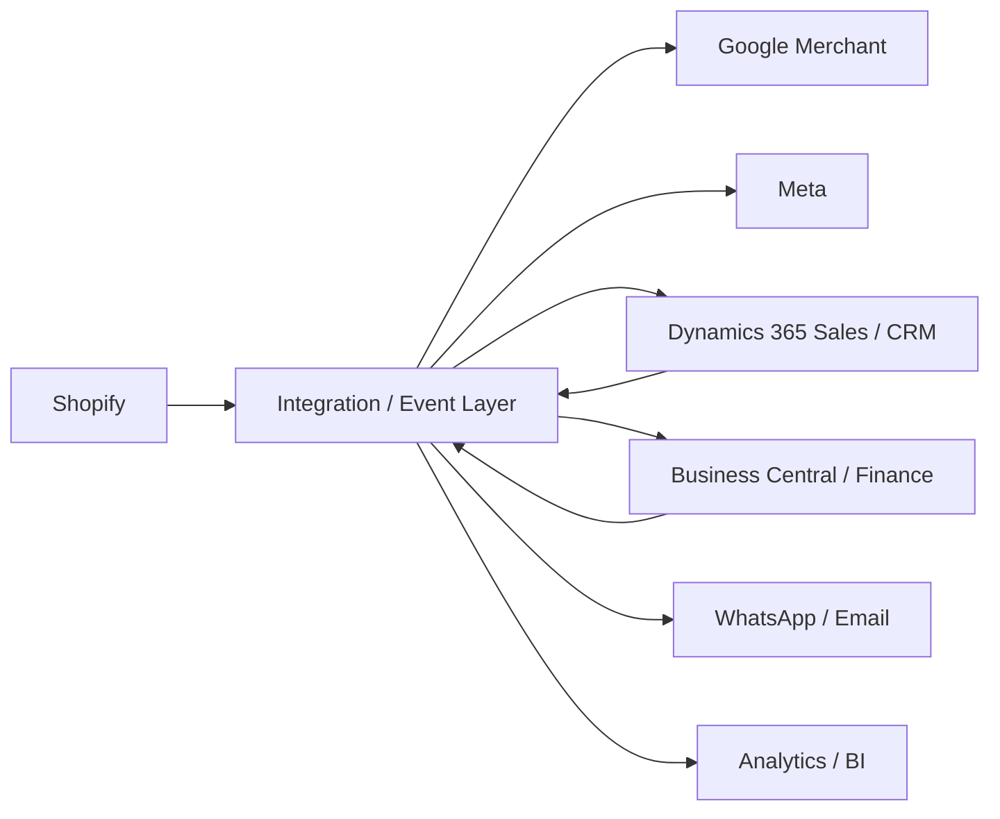

# Skunkworks Africa Sales & Omnichannel Automation SOP

## Purpose

This SOP defines the governed workflow used to move an approved Skunkworks Africa product or commercial offer from supplier intake to sale, fulfilment and weekly performance review.

The corporate website remains the company and operating gateway. Shopify at `store.skunkworks.africa` remains the commerce authority for product, price, inventory and checkout. The automation control centre at `/automation/` is an operator workflow surface, not a replacement commerce system.

## Control objective

A promotion is not considered launched until the required workflow gates are complete and evidence exists for the selected sales channels.



## Product tiers

| Tier | Use | Default commercial posture |
| --- | --- | --- |
| **A — Publish broadly** | Standardised products with dependable stock, clean catalogue data and healthy channel margin | Broad owned, paid and selected marketplace distribution |
| **B — Controlled channels** | Refurbished, low-stock, promotional or margin-sensitive products | Controlled release with explicit stock, warranty and marketplace profitability checks |
| **C — Sales-assisted** | Licensing, servers, enterprise solutions, training contracts, managed services and complex projects | Quote/RFQ and qualification first; marketplaces are not the default route |

## Eight workflow stages

### 1. Product intake

Required master data:

- SKU
- product title
- tier
- available quantity
- selling price
- campaign owner
- condition for refurbished or used hardware
- warranty and returns wording
- supplier/source reference in the authoritative procurement system

**Gate:** no product proceeds without a unique SKU, price, available stock and accountable owner.

### 2. Commercial approval

Validate:

- supplier cost excluding VAT
- customer selling price and VAT treatment
- gross profit and gross margin
- promotional discount
- logistics allowance
- transaction/channel fees
- warranty reserve where applicable
- minimum acceptable margin

The prototype calculates margin using:

```text
Net selling price = Selling price incl. VAT / (1 + VAT rate)
Gross profit      = Net selling price - Supplier cost excl. VAT
Gross margin %    = Gross profit / Net selling price
```

**Gate:** commercial approval, stock verification and warranty/condition verification must be complete and the calculated gross margin must meet the configured policy floor.

### 3. Shopify publication

Shopify is the canonical product authority.

Verify:

- canonical URL uses `https://store.skunkworks.africa/`
- product title/specifications match the approved master record
- price and compare-at price are correct
- inventory quantity is correct
- condition and warranty are visible
- images are approved
- delivery information is visible
- checkout path is functional

**Gate:** a verified canonical product URL and live-store approval are required.

### 4. Channel syndication

The workflow classifies each channel as Required, Recommended or Not Standard for the selected tier.

Core channels include:

- Shopify / Skunkworks Store
- Google Merchant Center for Tier A/B catalogue products
- WhatsApp Business
- LinkedIn
- Email / CRM
- Direct Sales / RFQ

Additional channels include Google Shopping/Performance Max, Google Search, Facebook, Instagram, Click-to-WhatsApp, YouTube, Microsoft Ads/Bing, Amazon.co.za, Takealot and Bob Shop.

**Gate:** every Required channel must be Ready or Live.

### 5. Campaign launch

Before paid scaling:

- use a stable campaign name
- use canonical destination URLs
- add `utm_source`, `utm_medium`, `utm_campaign` and `utm_content`
- keep SKU or product identifier available for attribution
- verify at least two approved acquisition channels are live for a broad product campaign
- preserve `gclid`, `fbclid` and equivalent click identifiers through the customer journey where the downstream platform supports them

**Gate:** campaign name plus at least two live acquisition channels.

### 6. Lead handling

Every inbound sales enquiry should have:

- source/channel
- SKU or offer
- sales owner
- response-time target
- current status
- next action
- quote/order reference when created

The prototype ships with a **15-minute high-intent response target** as a recommended operational default for staffed business hours. This is a policy target, not an assertion about current team performance, and must be adjusted to actual staffing.

**Gate:** sales owner and response-time policy are configured.

### 7. Order and fulfilment readiness

Verify:

- inventory reservation/decrement model
- payment/order authority
- picking/dispatch owner
- courier or delivery method
- customer communication
- returns and warranty hand-off
- finance posting/reconciliation path

**Gate:** operations marks fulfilment readiness before scale.

### 8. Weekly performance review

Minimum channel scorecard:

| Metric | Purpose |
| --- | --- |
| Ad spend | Acquisition investment |
| Leads | Top-of-funnel response |
| Quotes | Sales qualification/output |
| Orders | Closed transactions |
| Revenue | Commercial output |
| Gross profit | Contribution after product cost |
| CPL | Spend / leads |
| Lead → quote | Qualification effectiveness |
| Quote → order | Sales conversion |
| ROAS | Revenue / ad spend |

The review should also include stock remaining, ageing inventory, rejected Merchant products, disapproved ads, unanswered WhatsApp enquiries, abandoned carts and marketplace listing issues.

## Channel operating model

| Channel | Primary role | Tier posture |
| --- | --- | --- |
| Shopify | Commerce source of truth | A/B/C |
| Google Merchant | Feed and free listings | A/B |
| Google Shopping / PMax | Paid product acquisition | A/B |
| Google Search | High-intent acquisition | A/B/C |
| Facebook / Instagram | Demand generation and retargeting | A/B |
| WhatsApp Business | Conversational sales | A/B/C |
| Click-to-WhatsApp | Lead capture | A/B/C |
| LinkedIn | B2B acquisition | A/B/C |
| YouTube | Demonstration and trust | A/B/C |
| Microsoft Ads | Business search acquisition | A/B/C |
| Amazon.co.za | Marketplace | A/B, commercial review required |
| Takealot | Marketplace | A/B, commercial review required |
| Bob Shop | Marketplace / clearance | A/B |
| Email / CRM | Retention and nurture | A/B/C |
| Direct Sales / RFQ | Assisted conversion | A/B/C |

## Responsibilities

| Function | Accountability |
| --- | --- |
| Commercial | Supplier cost, price, margin, tier and promotion approval |
| Finance | VAT treatment, payment/reconciliation controls and commercial exceptions |
| Commerce | Shopify SKU, product data, inventory and checkout verification |
| Marketing | Channel plan, catalogue/feed readiness, creative, campaigns and UTMs |
| Sales | Lead ownership, qualification, quotation, next action and close |
| Operations | Inventory hand-off, fulfilment, delivery and returns |
| Management | Policy thresholds, exceptions, channel investment and weekly review |

## Automation architecture

### Current prototype

```text
Browser
  └── /automation/
      ├── config.js        Workflow policy and channel model
      ├── app.js           Gating, calculations, local persistence and export
      └── localStorage     Browser-local non-sensitive workflow state
```

The prototype intentionally has **no credentials and no direct API write-back**. It is safe for workflow design and operator testing, but it is not a production CRM or order-management system.

### Recommended production architecture



For a Microsoft-aligned stack, Power Automate and/or Azure Logic Apps can orchestrate business events, with Azure Functions used where custom transformation, signature validation, retry logic or channel-specific APIs require code. Production design should include:

- OAuth/OIDC service identities
- least-privilege scopes
- secret storage outside the repository
- webhook signature verification
- idempotency keys
- retry and dead-letter handling
- immutable audit events
- correlation IDs across Shopify, CRM and finance
- role-based access control
- POPIA-aware handling of personal information
- explicit consent and channel policy controls for customer communications

## Event catalogue for Phase 2

| Event | Trigger | Expected automation |
| --- | --- | --- |
| `product.approved` | Commercial approval | Create/update governed Shopify product draft |
| `product.published` | Shopify product live | Queue eligible channel syndication |
| `inventory.changed` | Stock update | Refresh channel availability / pause campaigns when required |
| `campaign.ready` | Required channels Ready | Open campaign launch approval |
| `lead.created` | Form/WhatsApp/ad lead | Create CRM lead/opportunity and assign owner |
| `quote.created` | Sales quotation | Update pipeline and campaign attribution |
| `order.created` | Shopify/order system | Create fulfilment and finance hand-off |
| `order.fulfilled` | Dispatch | Update customer communication and CRM history |
| `weekly.review` | Scheduled review | Aggregate spend, leads, quotes, orders, revenue and gross profit |

## Security constraints

1. Never place Shopify, Meta, Google, Microsoft, WhatsApp or marketplace credentials in static JavaScript or GitHub Pages.
2. Never store customer personal data in browser-local prototype state.
3. Production API calls must execute server-side or through a managed integration platform.
4. Webhooks must be authenticated and replay-resistant.
5. Channel publishers should receive only the minimum fields required for the channel.
6. Commercial overrides should require an auditable approval.
7. A channel marked Blocked must prevent paid scaling where that channel is required.

## Pilot: Dell Latitude 5490

The control centre is seeded with the current Dell Latitude 5490 promotion as a **Tier B** example because it is refurbished and inventory/margin sensitive.

The sample only pre-populates public campaign descriptors such as SKU placeholder, title and selling price. Supplier cost, actual stock verification, warranty approval, live channel status and product URLs remain deliberately unconfirmed until an operator supplies evidence.

## Production acceptance criteria

- [ ] Authentication and RBAC exist before real customer or supplier data is stored.
- [ ] Shopify remains authoritative for product/price/stock/checkout.
- [ ] Commercial margin thresholds are configurable by authorised users.
- [ ] Required channel gates are enforced.
- [ ] Every channel publication stores evidence and timestamp.
- [ ] Lead assignment has an auditable owner and SLA.
- [ ] Order/fulfilment events reconcile to finance.
- [ ] Weekly scorecard can report revenue and gross profit by source/channel.
- [ ] Secrets are held in managed secret storage, never Git.
- [ ] All production integrations have retry, failure and audit handling.
